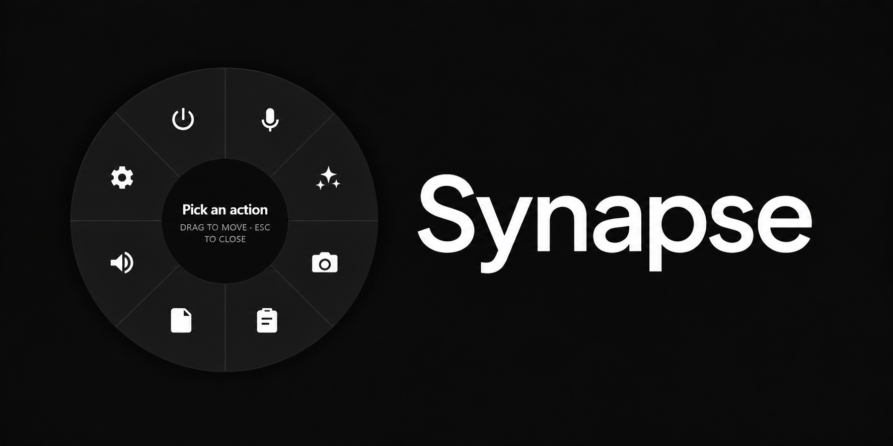

# Synapse

<p align="center">
  
</p>

Synapse is a cross-platform (macOS + Windows) desktop utility that puts voice dictation, quick AI assistance, and quick-capture tools one hotkey away. Pressing `Ctrl+Alt+Enter` summons a circular radial menu at the current mouse position, letting you pick an action with a single click, no app switching, no typing a command.

## Features

- **Speech-to-Text** - instant local voice dictation into any focused field
- **AI Assistance** - a text-based AI chat panel, one hotkey away
- **Capture tools** - Screenshot, Snippet (text templates), and Notepad (scratchpad)
- **Settings** - configurable shortcuts, AI provider/model selection, and app preferences

Built with [Tauri](https://tauri.app/) (Rust) and React/TypeScript.

## Prerequisites

- [Node.js](https://nodejs.org/) 18+
- [Rust](https://www.rust-lang.org/tools/install) (stable toolchain)
- On Windows: [Microsoft Visual C++ Build Tools](https://visualstudio.microsoft.com/visual-cpp-build-tools/) and [WebView2](https://developer.microsoft.com/microsoft-edge/webview2/) (usually preinstalled)
- On macOS: Xcode Command Line Tools

## Running locally

```bash
cd synapse
npm install
npm approve-scripts esbuild   # one-time, allows esbuild's install script to run
npm run tauri dev
```

This starts the Vite dev server and launches the Tauri app window. On first run, grant any OS permissions prompted (microphone access, accessibility, etc.) for dictation and text injection to work.

To build a production bundle:

```bash
npm run tauri build
```

## Speech-to-Text model

Local dictation uses the [Parakeet TDT 0.6B v2](https://huggingface.co/istupakov/parakeet-tdt-0.6b-v2-onnx) ONNX model. It isn't checked into this repo (~690 MB) and must be downloaded separately before `npm run tauri dev` will load it:

1. Download `config.json`, `decoder_joint-model.onnx`, `encoder-model.onnx`, and `vocab.txt` from the [model repo](https://huggingface.co/istupakov/parakeet-tdt-0.6b-v2-onnx/tree/main).
2. Place all four files in `synapse/src-tauri/model/` (create the folder if it doesn't exist).

`synapse/src-tauri/model/` is gitignored, so this step needs to be repeated on every machine you run the app on.

## Project structure

- `synapse/src` - React/TypeScript frontend
- `synapse/src-tauri` - Rust backend (Tauri commands, audio, AI, settings)
- `synapse_prd.md` - product requirements and design rationale
- `spikes/` - standalone proofs of concept, not part of the shipped app

## License

See [LICENSE](LICENSE).
