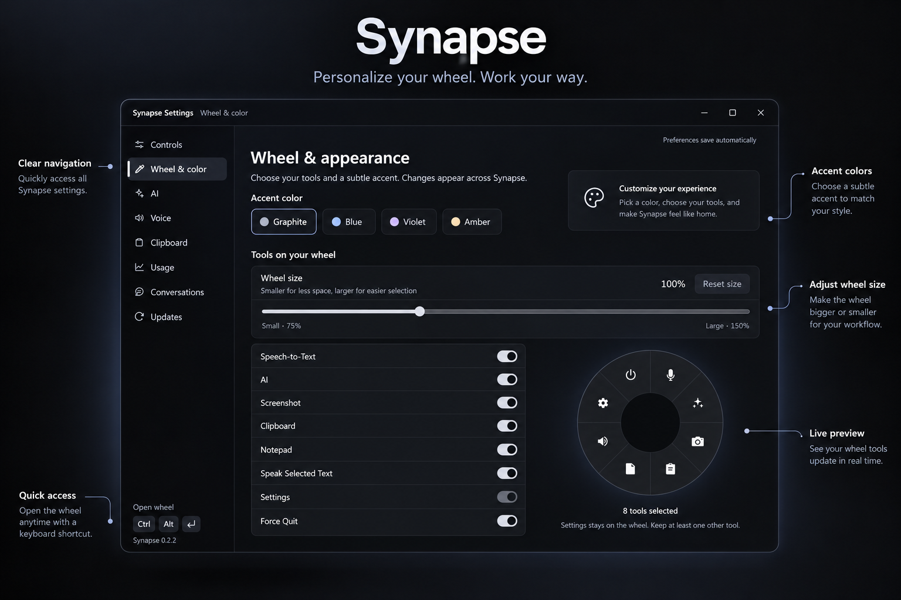
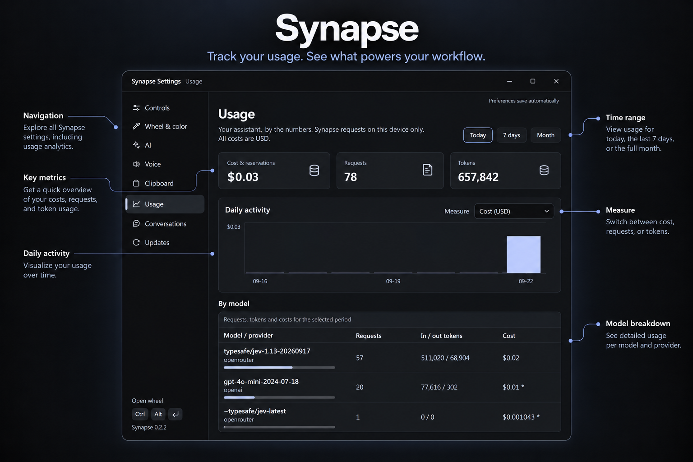

# Synapse

[](https://github.com/sahil-sharma-50/Synapse/actions/workflows/pr.yml)

<p align="center">
  
</p>

<p align="center">
  <a href="https://github.com/sahil-sharma-50/Synapse/releases/latest">Download for Windows</a> ·
  <a href="CONTRIBUTING.md">Contribute</a> ·
  <a href="LICENSE">License</a>
</p>

Synapse puts dictation, AI assistance, and capture tools one shortcut away. Press `Ctrl+Alt+Enter` to open a radial menu at your cursor, or use the direct dictation shortcut (`Ctrl+Alt+D`). Both shortcuts can be changed in Settings → Controls.

**Windows is supported and tested.** macOS code exists but has not been tested on macOS hardware. The current release provides a Windows x64 installer.

## Install

Download the `Synapse_*_x64-setup.exe` from the [latest release](https://github.com/sahil-sharma-50/Synapse/releases/latest). First-run setup explains microphone access and the optional local speech downloads. You can skip those downloads and start them later in Settings → Voice.

Installed users can check **Settings → Updates** and choose when to download and install a signed update. Installing restarts the app.

## Features

The radial menu provides eight actions:

| Action              | What it does                                                                                                                         |
| ------------------- | ------------------------------------------------------------------------------------------------------------------------------------ |
| Speech-to-Text      | Dictates locally into the previously focused app. Press Enter or click the listening circle to finish.                               |
| AI                  | Opens the voice orb for streamed conversation and spoken replies. Supports Anthropic, OpenAI, and OpenRouter with your own API keys. |
| Screenshot          | Captures the monitor under the cursor, saves a PNG to `Pictures/Synapse`, and copies it to the clipboard.                            |
| Clipboard           | Searches, pins, and pastes clipboard history. History can be disabled or cleared in Settings.                                        |
| Notepad             | Opens the Notes Hub for rich notes, folders, and sticky note windows.                                                                |
| Speak Selected Text | Reads selected text aloud with the optional local voice engine or the OS voice fallback.                                             |
| Settings            | Controls shortcuts, wheel appearance, AI, voice, clipboard, usage, conversations, and updates.                                       |
| Force Quit          | Exits the background app.                                                                                                            |

### Make the wheel yours

Choose which tools appear, adjust the wheel size, and pick an accent in Settings → Wheel & color.

<p align="center">
  
</p>

### Understand AI usage

Settings → Usage shows local request, token, and cost estimates over time, including a breakdown by model.

<p align="center">
  
</p>

Synapse also lives in the system tray. AI conversations and usage are stored locally; provider requests use your own API keys, which are kept in the OS credential store. Clipboard history may contain sensitive copied text, so review its retention and capture settings.

## Run from source

You need Node.js 22, a stable Rust toolchain, and on Windows the MSVC build tools and WebView2 runtime.

```powershell
cd synapse
npm ci
npm run tauri dev
```

The optional ASR model is about 630 MB and is downloaded through onboarding or Settings → Voice. The optional local voice engine downloads a Python runtime and model files into the app data directory and uses roughly 1–2 GB. Neither is checked into Git.

For contributor setup, checks, and pull request guidance, see [CONTRIBUTING.md](CONTRIBUTING.md). The [app README](synapse/README.md), [Rust README](synapse/src-tauri/README.md), [design guide](DESIGN.md), and [agent guide](AGENTS.md) cover the codebase in more detail.

## License

See [LICENSE](LICENSE).
